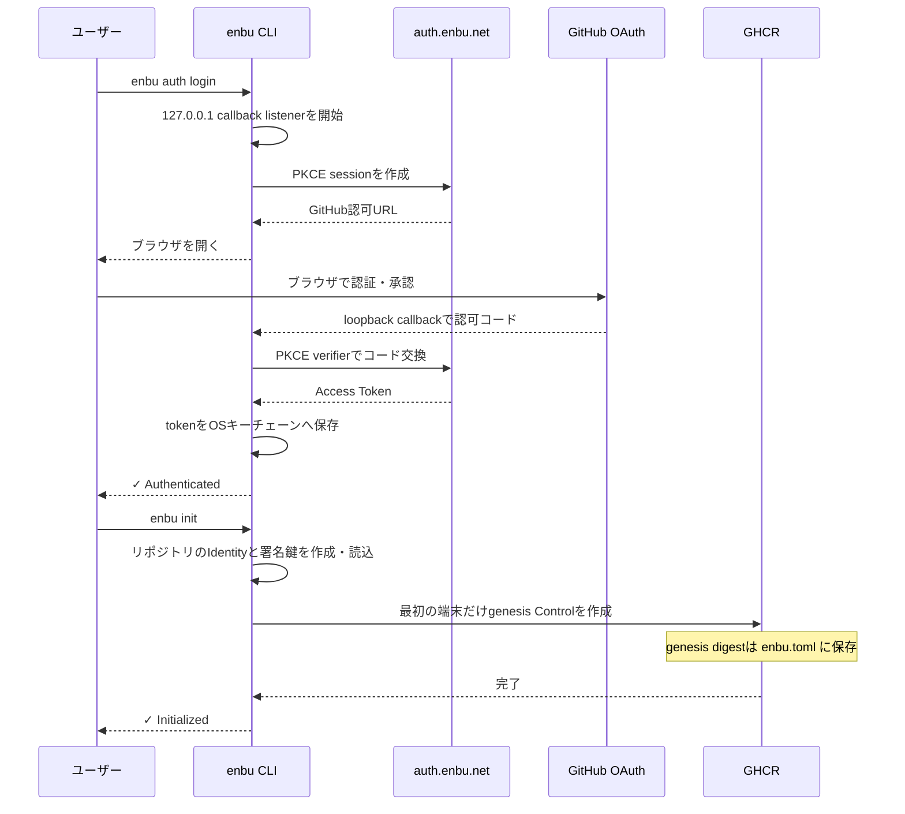
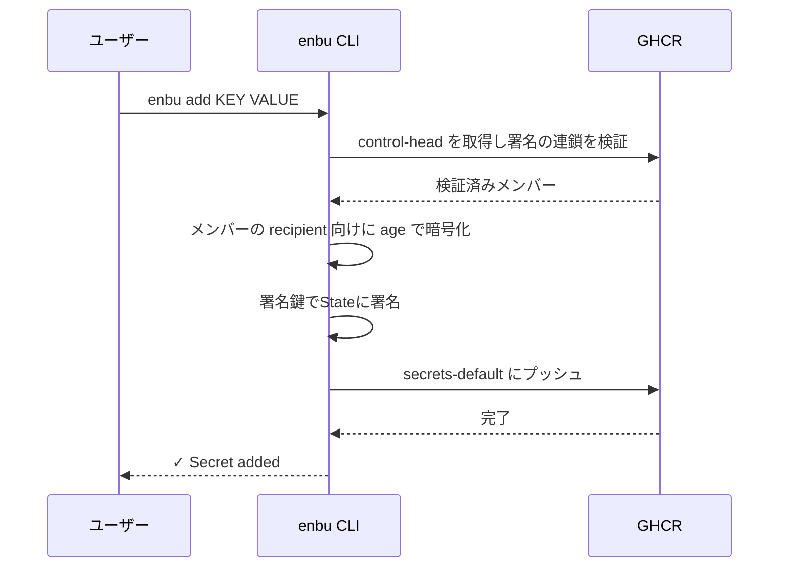
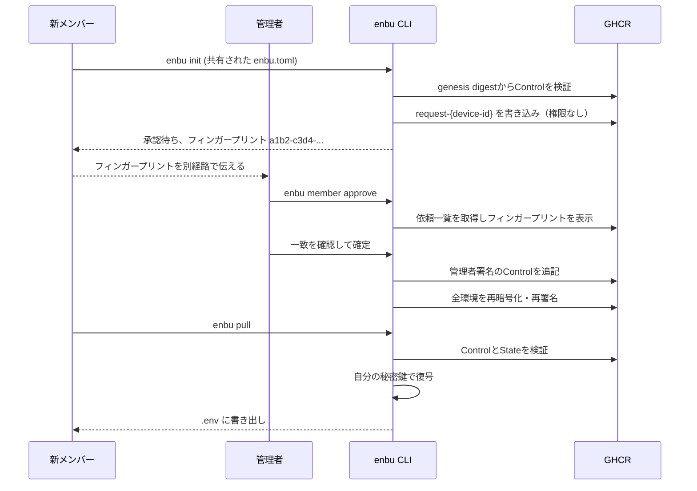

# 💃 enbu

GitHubだけで完結する `.env` 管理ツール  

## なぜ

開発にはAPIキーやDBのパスワードといった機密情報が欠かせないが以下のような問題点がある  

- Slack/Discord/メールはE2EE非対応
    - 「1」「I」「l」のような紛らわしい文字や斜体表示による見間違いがエラーの温床にも
    - 変更のたびに全員へ連絡が必要で負荷が高い
    - 暗号化するにしても
        - 暗号化ファイルを送っても、パスワードや復号鍵の受け渡し経路が安全でない
- 専用品を使えば解決では？
    - 外部サービス利用時のコスト・運用負荷が課題
        - AWS/Google Cloud/1Password等の導入には契約やアカウント管理が必要
        - 運用面・金銭面の両方で組織の大きな負担に
- じゃあGitに含めたらいいじゃん！
    - Git履歴に機密情報の暗号文が永続的に残存
    - 将来的なアルゴリズム脆弱化により、後から解読される危険性

## 特徴

- **GitHubだけで完結** ほかのプラットフォームに依存することなく完結
- **E2E暗号化** 復号できるのは各メンバーのローカル秘密鍵のみ  
- **使いやすいCLI** セットアップを済ませれば `enbu add` と `enbu pull` だけすればいい  
<!-- 実装中-->
<!--- **機密情報の流出検知・防止** .env等の機密ファイルのcommitやべた書きを防止-->
<!--- **改ざん検知** Sigstoreによる署名と検証により改ざんを検知  -->
<!--- **ポリシー制御** OPA/Regoによるポリシー制御  -->

## インストール

```bash
go install github.com/enbu-net/enbu@latest
```

または [Releases](https://github.com/enbu-net/enbu/releases) からバイナリをダウンロード  

## クイックスタート

### 1. 認証

```bash
enbu auth login
```

GitHubにログインします  
ヘッドレス環境では、`enbu auth login --device`を実行し、表示されたコードをGitHubで入力します。

### 2. リポジトリの初期化

```bash
cd your-repo
enbu init
```

各ユーザーごとにそのリポジトリで1度初期化をします  
以下が自動で行われます  

- ハードウェアIdentityの作成・再利用（利用不可ならOS keyring）
- 暗号化鍵とは別の署名鍵の作成（利用可能ならハードウェアP-256、なければOS keyringのEd25519）
- 最初の端末はWorkspace Controlを作成して管理者になり、信頼の起点となるdigestを `enbu.toml` の `control_genesis` に保存
- `enbu.toml` の作成
- `.gitignore` の更新

### 3. シークレットの追加・編集

```bash
enbu add DATABASE_URL "postgres://..."
enbu add API_KEY "sk-..."
enbu edit API_KEY "sk-new..."

# 環境別シークレット
enbu add --env dev DATABASE_URL "postgres://dev/..."
enbu add --env prod DATABASE_URL "postgres://prod/..."
```

`add` は新規シークレット専用で、同じキーが既にある場合は失敗します。既存シークレットの更新には `edit` を使います。

### 4. シークレットの削除

```bash
enbu delete API_KEY
```

### 5. シークレットの取得

```bash
enbu pull # .env ファイルに書き出し
enbu pull --env dev # dev の設定済み出力先に書き出し
```

### 6. メンバーの追加

Storageへ書き込めるだけではメンバーになれません。
新しいメンバーは、共有された `enbu.toml` があるリポジトリで `enbu init` を実行します。
承認依頼が置かれ、端末のフィンガープリント（例: `a1b2-c3d4-e5f6-0718-293a`）が表示されます。
このフィンガープリントを、チャットや対面など別の経路で管理者へ伝えます。
管理者は一覧から依頼を選んで承認します。

```bash
enbu member approve     # 依頼を選び、フィンガープリントを照合して確定
enbu member requests    # 承認待ちの端末一覧
enbu member list        # メンバー一覧
enbu member remove      # メンバーを削除し、その端末を除いて再暗号化
```

承認すると全環境が再暗号化されるため、新メンバーはすぐに `enbu pull` できます。
スクリプトでは `--device <フィンガープリントまたはdevice id>`（確認を省くなら `--yes`）を指定します。
TUI（`enbu`）とデスクトップアプリのメンバー画面にも同じ承認リストがあります。

メンバーを削除しても、その端末がすでに読み取ったシークレットは取り消せません。ローテーションしてください。

## 環境

`enbu switch` で環境を管理します:

```bash
enbu switch -c dev          # dev を作成して切り替え
enbu switch -c prod         # prod を作成して切り替え
enbu switch dev             # dev に切り替え
enbu switch -               # 前の環境に戻る
enbu switch -l              # 環境一覧
enbu switch -d staging      # 環境を削除
enbu switch -m old new      # 環境をリネーム
```

`enbu.toml` で環境と出力ファイルを定義:

```toml
version = "0.1"
default = "dev"

[env.dev]
output = ".env.dev"

[env.prod]
output = ".env.prod"
```

`add`、`edit`、`delete`、`pull`、`sync` で `-e`/`--env` を指定すると現在の環境を一時的に上書きします。recipient は全環境で共有され、アクセス制御は sync 時の OPA/Rego ポリシーで行います。`-e` を省略すると `switch` で設定した環境が使われます。

## Identityの保管

新規IdentityはLinux／WindowsでTPM 2.0、macOSでSecure Enclaveを優先します。
ハードウェアのP-256秘密鍵は端末から取り出しません。
age Tagged Recipientを使い、X25519 recipientと同じファイルへ暗号化できます。

| OS | ハードウェア | 新規作成時のfallback |
|----|--------------|---------------------|
| Linux | TPM 2.0（`/dev/tpmrm0`優先） | Secret Service（GNOME Keyring / KWallet） |
| Windows | TBS経由のTPM 2.0 | Credential Manager |
| macOS | Secure Enclave | Keychain |

```bash
enbu doctor                   # 認証不要・永続鍵を作らず検査
enbu identity create          # 現在のリポジトリ用Identityを作成・再利用
enbu identity show            # backend、algorithm、recipient、deviceを表示
export ENBU_IDENTITY_BACKEND=auto  # 既定。hardware利用不可ならkeyring
# hardware: ハードウェア必須 / keyring: X25519をOS keyringへ保存
```

fallbackは鍵作成前の利用可否検査だけで決めます。
作成開始後の失敗や保存済みIdentityのロード失敗では、別の鍵を作りません。
`init`は登録失敗後の再実行でも、保存済みの暗号化鍵と署名鍵を使い続けます。
TPMでは元の端末でのみロード可能な子鍵blobを、Secure EnclaveではKeychainの参照を保存します。
Secure Enclave鍵は端末のロック解除中に利用でき、毎回のTouch IDは要求しません。
macOSでSecure Enclave鍵を永続保存するには、実行ファイルの署名entitlementとユーザーのログインセッションによるdata-protection Keychainへのアクセスが必要です。
`doctor`は永続鍵を作らずにこのアクセスを検査します。
署名のない単体ビルドではOS keyringへfallbackする場合があります。

version 1 metadataはenbuのローカルデータディレクトリの`identities/`へ保存します。
`XDG_DATA_HOME`設定時は`$XDG_DATA_HOME/enbu/identities/`、未設定時はOSごとのアプリデータディレクトリです。
旧Identityの移行・読込は行いません。平文Identity backendは廃止しました。
`ENBU_BACKEND`は認証トークン用の設定で、Identity backendの選択には使いません。

Identity E2Eは固定したテスト専用vTPM SDKとローカルOCI HTTP fixtureを使い、3 OSで実行します。
ロック解除済みOS keyringがある環境で`task identity/test/e2e`を実行できます。
通常のCLIにはsoftware TPM transportを組み込みません。
実TPM／Secure Enclaveの実機テストは`ENBU_TEST_NATIVE_IDENTITY=1 go test -v ./pkg/identity`で実行します。
実機検証はGitHub-hosted runnerの必須E2E matrixとは別です。
Linux／Windowsの実TPMでは、`ENBU_TEST_NATIVE_IDENTITY=1 go test -v -count=1 -timeout=5m -tags=identitye2e -run '^TestNativeTPMCLI$' ./test/identitye2e`でCLI全体を検証できます。
通常ビルドのCLI、一時リポジトリ、ホストの実TPM、ローカルHTTP fixtureを使い、init/add/pull/edit/sync/historyとCLIプロセス間のIdentity再ロードを確認します。

## JSON出力

VS Code拡張などのプロセスからenbuを実行する場合は、任意のコマンドへ `--json` を指定します。
コマンドは標準出力へJSONを一つだけ出力します。

```json
{"ok":true,"data":{"action":"add","environment":"dev","key":"API_KEY"},"warnings":[]}
{"ok":false,"error":{"message":"secret \"API_KEY\" already exists"}}
```

成功時の終了コードは0です。
失敗時も標準出力へJSONを出力し、終了コード1で終了します。
`enbu pull --json` は `.env` を書き込まず、復号したシークレットを `data.secrets` で返します。
このレスポンスをログへ記録したり、永続化したりしないでください。
Device Flowは認証完了前にコードを表示する必要があるため、`enbu auth login --device --json` には対応していません。
ブラウザ認証には `enbu auth login --json` を使います。

## 仕組み

```
Storage (OCI registry / S3 prefix / Local directory)
├── control-head                        ← 署名付きメンバー一覧（管理者署名の連鎖）
├── request-{device-id}                 ← 参加依頼（権限は持たない）
├── secrets-default                     ← default 環境の暗号文を指す署名付き State
├── secrets-dev                         ← dev 環境の暗号文を指す署名付き State
├── enbu-workspace                       ← Workspace UUID
└── hist-{env-hash}-{time}-{uuid}       ← 過去バージョンの署名付き State
```

Storageは信頼しません。Refは場所を示すヒントにすぎず、権限は署名にあります。

- **署名付きControl** 信頼する端末、署名鍵、age recipientの一覧です。新しいControlは直前のControlの管理者が署名し、`enbu.toml` のgenesis digestから検証します。
- **署名付きState** 暗号文のdigestと、書き込んだ端末を結び付けます。読む側は作者が現在のメンバーで署名が正しいことを確認してから復号します。
- **ローカルcheckpoint** この端末が受け入れた最新のControlとStateを覚え、古いものを返されたら拒否します。
- recipientは検証済みControlだけから作られます。署名鍵は暗号化鍵とは別で、Storageへは保存されません。

対象外: Storageによるサービス拒否、最新revisionを隠すfreeze、checkpointのない新規端末への古いState提示、悪意ある管理者、盗まれた管理者の署名鍵。

1. `enbu add`  - 新規シークレットを検証済みメンバーの公開鍵で暗号化し、署名付きStateとして書き込み  
2. `enbu edit` - 暗号化された bundle 内の既存シークレットを更新し、署名して書き込み  
3. `enbu delete` - 暗号化された bundle からシークレットを削除し、署名して書き込み  
4. `enbu pull` - Control と State を検証してから復号し、`.env` に書き出し  
5. `enbu sync` - 現在のメンバー一覧で再暗号化・再署名  

### 認証・初期化フロー



### シークレット追加フロー



### メンバー追加フロー


