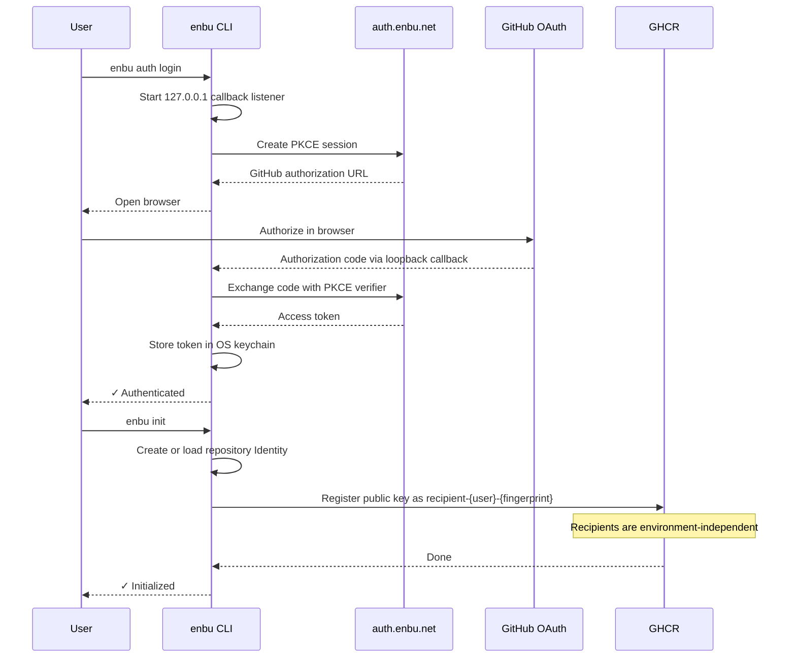
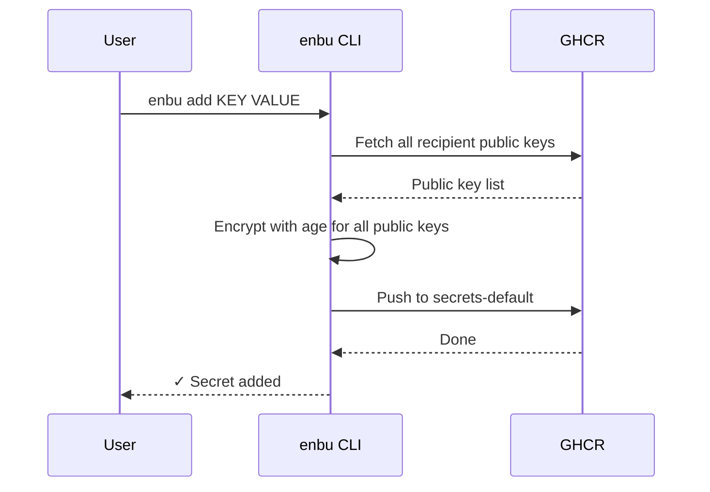
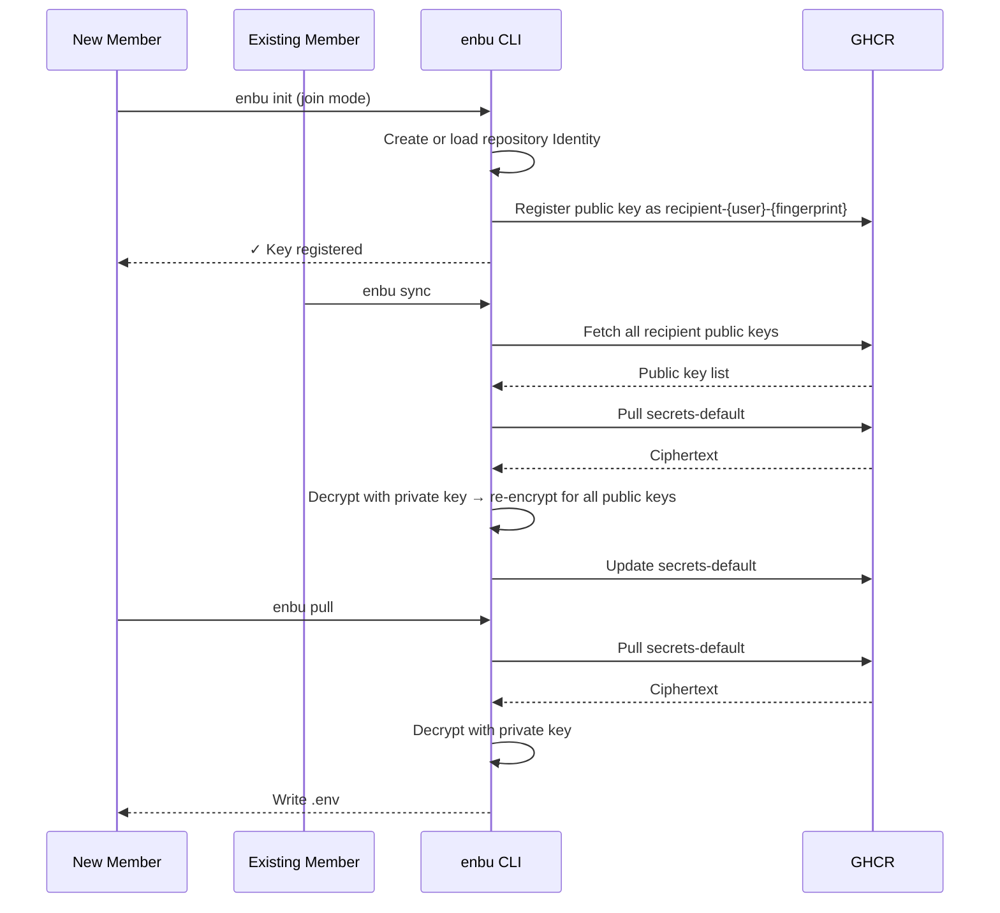

# 💃 enbu

A `.env` management tool that works entirely within GitHub.

## Why

Development requires sensitive information like API keys and database passwords, but existing approaches have problems:

- Slack/Discord/Email lack E2EE
    - Confusing characters like `1`, `I`, `l` and italic rendering cause copy-paste errors
    - Every change requires notifying everyone manually
    - Even if you encrypt: the delivery channel for the password or decryption key is often insecure
- Dedicated secret managers?
    - External services come with cost and operational overhead
        - AWS/Google Cloud/1Password require contracts and account management
        - Significant organizational burden in both cost and operations
- Just commit it to Git!
    - Ciphertext persists permanently in Git history
    - Future algorithm weaknesses could allow retroactive decryption

## Features

- **GitHub-only** — No dependency on external platforms
- **E2E encrypted** — Only each member's local private key can decrypt
- **Simple CLI** — After setup, just `enbu add` and `enbu pull`
<!-- Planned -->
<!--- **Secret leak prevention** — Prevent committing .env files or hardcoded secrets -->
<!--- **Tamper detection** — Sigstore-based signing and verification to detect tampering -->
<!--- **Policy control** — OPA/Rego-based policy enforcement -->

## Install

```bash
go install github.com/enbu-net/enbu@latest
```

Or download a binary from [Releases](https://github.com/enbu-net/enbu/releases).

## Quick Start

### 1. Authenticate

```bash
enbu auth login
```

Log in to GitHub.
For a headless environment, use `enbu auth login --device` and enter the displayed code on GitHub.

### 2. Initialize the repository

```bash
cd your-repo
enbu init
```

Run once per user per repository. This automatically:

- Creates or reuses a hardware Identity, with OS keyring fallback
- Registers the public key on GHCR
- Creates `enbu.toml`
- Updates `.gitignore`

### 3. Add or edit secrets

```bash
enbu add DATABASE_URL "postgres://..."
enbu add API_KEY "sk-..."
enbu edit API_KEY "sk-new..."

# Environment-specific secrets
enbu add --env dev DATABASE_URL "postgres://dev/..."
enbu add --env prod DATABASE_URL "postgres://prod/..."
```

`add` creates a new secret and fails if the key already exists. Use `edit` to update an existing secret.

### 4. Delete secrets

```bash
enbu delete API_KEY
```

### 5. Pull secrets

```bash
enbu pull  # Writes to .env file
enbu pull --env dev  # Writes to the configured output for dev
```

### 6. Add a team member

A new member runs `enbu init` inside the repository to enter join mode and register their public key.  
An existing member then runs `enbu sync` locally to re-encrypt secrets for the new recipient.

## Environments

Manage environments with `enbu switch`:

```bash
enbu switch -c dev          # Create and switch to dev
enbu switch -c prod         # Create and switch to prod
enbu switch dev             # Switch to dev
enbu switch -               # Switch back to previous
enbu switch -l              # List environments
enbu switch -d staging      # Delete an environment
enbu switch -m old new      # Rename an environment
```

Define environments in `enbu.toml`:

```toml
version = "0.1"
default = "dev"

[env.dev]
output = ".env.dev"

[env.prod]
output = ".env.prod"
```

Use `-e`/`--env` with `add`, `edit`, `delete`, `pull`, and `sync` to override the current environment. Recipients are shared across all environments — access control is handled by OPA/Rego policy at sync time. Without `-e`, enbu uses the environment set by `switch`.

## Identity storage

New repository identities prefer TPM 2.0 on Linux and Windows, and Secure Enclave on macOS.
Hardware P-256 private keys stay on the device. Encryption uses age Tagged Recipients;
X25519 recipients can be included in the same encrypted file.

| OS | Hardware | Fallback for new identities |
|----|----------|-----------------------------|
| Linux | TPM 2.0 (`/dev/tpmrm0`, then `/dev/tpm0`) | Secret Service (GNOME Keyring / KWallet) |
| Windows | TPM 2.0 through TBS | Credential Manager |
| macOS | Secure Enclave | Keychain |

```bash
enbu doctor                  # No authentication or persistent key creation
enbu identity create         # Create or reuse this repository's local Identity
enbu identity show           # Backend, algorithm, recipient and device
export ENBU_IDENTITY_BACKEND=auto  # Default: hardware if available, otherwise keyring
# Other choices: hardware (required), keyring (X25519 stored in the OS keyring)
```

Fallback is allowed only when hardware is unavailable before creation begins.
Creation errors and saved-key load errors never silently replace the key.
`init` registers the saved recipient and reuses it after a registration failure.
Hardware identities have no private-key export API. TPM metadata contains encrypted
child blobs bound to the original TPM; Secure Enclave metadata contains a Keychain
reference. Secure Enclave keys require the device to be unlocked and do not prompt
for Touch ID on every use.
On macOS, permanent Secure Enclave storage requires access to the data-protection
Keychain through the executable's signing entitlements and a user login session.
`doctor` checks this access without creating a permanent key. Unsigned standalone
builds may use the OS keyring fallback instead.

Version 1 metadata is stored under `identities/` in enbu's local data directory
(`$XDG_DATA_HOME/enbu` when set; otherwise the platform's application data directory).
Old identities are not migrated or loaded. Plaintext Identity storage is removed.
`ENBU_BACKEND` configures authentication token storage only and does not select an Identity backend.

Identity E2E runs on Linux, Windows and macOS with a pinned test-only vTPM SDK and
local OCI HTTP fixture. Run `task identity/test/e2e` with an unlocked OS keyring.
The normal CLI excludes the software TPM transport. On a real TPM or Secure Enclave
device, run `ENBU_TEST_NATIVE_IDENTITY=1 go test -v ./pkg/identity` for native integration tests.
Hardware device validation is separate from the required GitHub-hosted E2E matrix.

## JSON output

Pass `--json` to any command when invoking enbu from a process such as a VS Code extension.
The command writes exactly one JSON value to stdout.

```json
{"ok":true,"data":{"action":"add","environment":"dev","key":"API_KEY"},"warnings":[]}
{"ok":false,"error":{"message":"secret \"API_KEY\" already exists"}}
```

Successful commands exit with status 0.
Errors are also written to stdout as JSON and exit with status 1.
`enbu pull --json` does not write an `.env` file; it returns the decrypted secrets in `data.secrets`.
Do not log or persist this response.
`enbu auth login --device --json` is unsupported because Device Flow must display a code before authentication finishes.
Use `enbu auth login --json` for browser authentication.

## How It Works

```
GHCR (ghcr.io/{owner}/{repo}-enbu)
├── recipient-{user}-{fingerprint}      ← Public keys (shared across all environments)
├── secrets-default                     ← Encrypted secrets for default environment
└── secrets-dev                         ← Encrypted secrets for dev environment
```

1. `enbu add` — Creates a new secret, encrypts for all recipients' public keys, and pushes as an OCI image artifact
2. `enbu edit` — Updates an existing secret in the encrypted bundle and pushes the updated artifact
3. `enbu delete` — Removes a secret from the encrypted bundle and pushes the updated artifact
4. `enbu pull` — Pulls ciphertext, decrypts with your private key, writes to `.env`
5. `enbu sync` — Re-encrypts with the current recipient list when members are added or removed

### Authentication & Initialization Flow



### Secret Addition Flow



### Member Addition & Sync Flow


