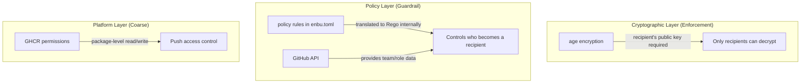
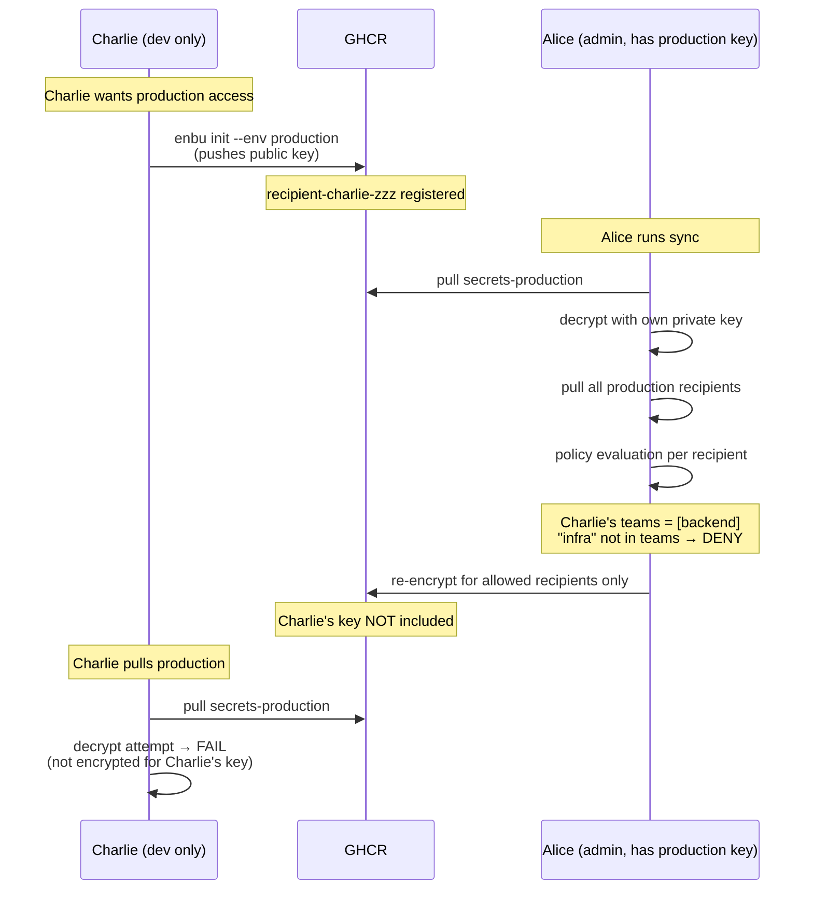
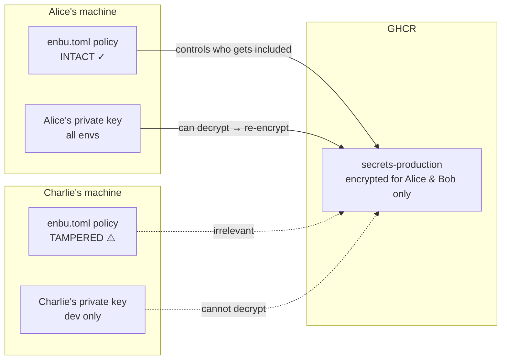
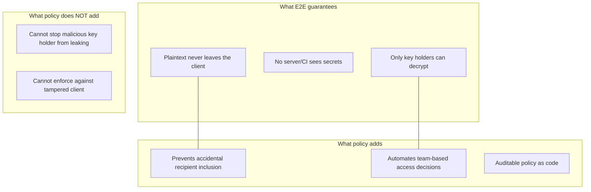
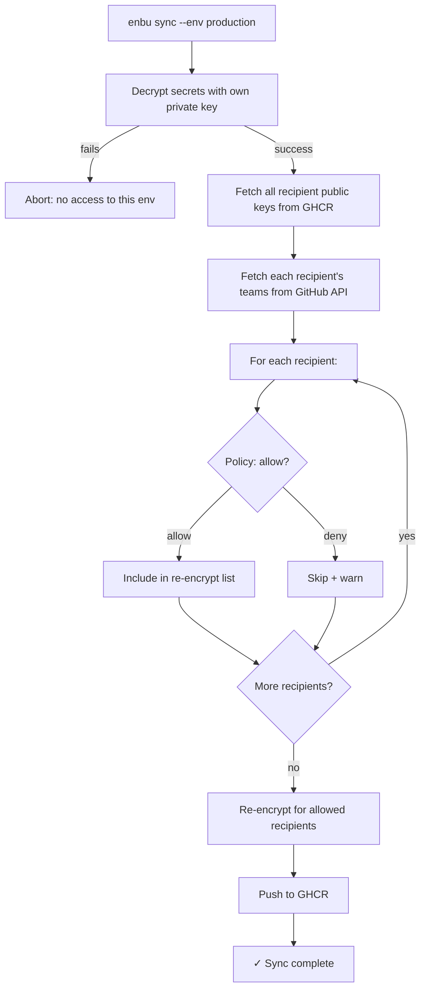

# Policy Design: Environment Access Control

## Overview

enbu uses a layered security model combining **age encryption** (cryptographic enforcement) with **policy rules** (operational guardrails) to control per-environment access.

Policy rules are declared in `enbu.toml` using a simple, structured format. Users never need to write Rego directly — enbu translates the declarative rules into OPA/Rego internally. A raw Rego escape hatch is available for advanced use cases.

## Trust Model



## Key Insight: Who Evaluates the Policy Matters



## Why Local Policy Tampering Is Not a Threat



| Attacker | Tampers policy? | Impact |
|----------|-----------------|--------|
| Charlie (no production key) | Yes | None. Cannot run `sync --env production` (decryption fails) |
| Alice (has production key) | Yes | She already has plaintext access. Tampering adds no new capability |

The policy is evaluated by the **sync executor** — who already holds the decryption key. This means:

- The only person whose policy matters is someone we **already trust** (they have the private key)
- No additional trust assumptions beyond E2E encryption's inherent model

## End-to-End Encryption Preserved



## Policy Configuration in `enbu.toml`

### Syntax

Policy rules are declared per environment using `policy.allow` (and optionally `policy.deny`). The evaluation semantics are:

- **`policy.allow = [ ... ]`** — array of rule objects. Recipient is allowed if **any one rule (OR)** matches.
- **Each rule `{ key = val, ... }`** — all conditions within a single rule must match **(AND)**.
- **`policy.deny = [ ... ]`** — (optional) array of rule objects evaluated after allow. If **any one rule (OR)** matches, recipient is denied even if allow passed.

### Available Rule Fields

| Field | Type | Description | Source |
|-------|------|-------------|--------|
| `user` | string | GitHub username | GHCR recipient tag |
| `team` | string | GitHub organization team slug | `GET /orgs/{org}/teams/{team}/members` (org repos only) |
| `permission` | string | Repository permission level (`admin`, `write`, `read`) | `GET /repos/{owner}/{repo}/collaborators/{user}/permission` |

### Presets

For common patterns, `policy.preset` provides a single-value shorthand:

| Preset | Equivalent `policy.allow` |
|--------|---------------------------|
| `"collaborators"` | `[{ permission = "write" }, { permission = "admin" }]` |
| `"admin"` | `[{ permission = "admin" }]` |

### Custom Rego (Escape Hatch)

For advanced use cases that cannot be expressed with declarative rules, `policy.file` points to a raw Rego file:

```toml
[env.secure-env]
output = ".env.secure"
policy.file = "custom_policy.rego"
```

### Full Example

```toml
version = "v1alpha1"
default_env = "dev"

# Preset: all collaborators with write/admin permission
[env.dev]
output = ".env.local"
policy.preset = "collaborators"

# Rule array: backend team with write permission, OR infra team
[env.staging]
output = ".env.staging"
policy.allow = [
  { team = "backend", permission = "write" },
  { team = "infra" },
]

# Rule array with deny: infra team or specific users, excluding contractors
[env.production]
output = ".env.production"
policy.allow = [
  { team = "infra" },
  { user = "alice" },
  { user = "bob" },
]
policy.deny = [
  { team = "external-contractors" },
]

# Custom Rego for complex logic
[env.secure-env]
output = ".env.secure"
policy.file = "custom_policy.rego"
```

### Policy for Personal Repositories

Personal repositories (non-org) do not have GitHub Teams. Use `permission` and `user` fields instead:

```toml
# Owner only (admin permission)
[env.production]
output = ".env.production"
policy.preset = "admin"

# All collaborators (write/admin permission)
[env.dev]
output = ".env.local"
policy.preset = "collaborators"

# Specific users
[env.staging]
output = ".env.staging"
policy.allow = [
  { user = "alice" },
  { user = "bob" },
]
```

Note: on personal repositories, collaborators are always granted `write` permission. There is no `read` collaborator — non-collaborators viewing a public repo are `read` but cannot be recipients since they have no registered key.

## Concrete Example

### Team Structure (GitHub)

```
org/infra   → [Alice, Bob]
org/backend → [Alice, Bob, Charlie]
```

### Policy (`enbu.toml`)

```toml
[env.dev]
output = ".env.local"
policy.preset = "collaborators"

[env.staging]
output = ".env.staging"
policy.allow = [
  { team = "backend" },
]

[env.production]
output = ".env.production"
policy.allow = [
  { team = "infra" },
]
```

### Result Matrix

| Person | dev | staging | production |
|--------|-----|---------|------------|
| Alice (infra, backend) | ✓ | ✓ | ✓ |
| Bob (infra, backend) | ✓ | ✓ | ✓ |
| Charlie (backend) | ✓ | ✓ | ✗ |

## Sync Flow with Policy Evaluation



## Go Type Definitions

```go
type EnvironmentConfig struct {
    Output string       `toml:"output"`
    Policy PolicyConfig `toml:"policy"`
}

type PolicyConfig struct {
    Preset string       `toml:"preset,omitempty"`
    File   string       `toml:"file,omitempty"`
    Allow  []RuleConfig `toml:"allow,omitempty"`
    Deny   []RuleConfig `toml:"deny,omitempty"`
}

type RuleConfig struct {
    User       string `toml:"user,omitempty"`
    Team       string `toml:"team,omitempty"`
    Permission string `toml:"permission,omitempty"`
}
```

### Policy Modes

`policy` must be exactly one of three mutually exclusive modes. Mixing modes is a configuration error.

| Mode | Fields | Description |
|------|--------|-------------|
| **Preset** | `preset` | Shorthand for common patterns |
| **Rules** | `allow` (and optionally `deny`) | Declarative rule arrays |
| **Custom** | `file` | Raw Rego file |

If no `policy` is set, no policy enforcement is applied (all recipients are allowed).

Setting `preset` together with `allow`/`deny`, or `file` together with any other field, is a **configuration error**.

### Validation Rules

- `preset`, `allow`/`deny`, and `file` are mutually exclusive. Combining any of them is a configuration error.
- Empty `allow` with non-empty `deny` is a configuration error (nothing can be allowed).
- Each `RuleConfig` must have at least one non-empty field.
- `permission` must be one of: `admin`, `write`, `read`.
- `team` is only effective for organization repositories. Using `team` on a personal repository emits a warning and the rule is skipped.

## Internal Translation to Rego

enbu translates `enbu.toml` policy rules to Rego internally. Users never interact with Rego directly unless they opt in via `policy.file`.

### Translation Example

Given:

```toml
[env.production]
output = ".env.production"
policy.allow = [
  { team = "infra" },
  { user = "alice" },
]
policy.deny = [
  { team = "external-contractors" },
]
```

enbu generates the equivalent Rego:

```rego
package enbu

import rego.v1

default allow_recipient := false

# allow: rule 0
allow_candidate if {
    "infra" in input.recipient.teams
}

# allow: rule 1
allow_candidate if {
    input.recipient.username == "alice"
}

# deny: rule 0
deny_recipient if {
    "external-contractors" in input.recipient.teams
}

allow_recipient if {
    allow_candidate
    not deny_recipient
}
```

## Policy Input: What enbu Provides to Rego

enbu constructs the Rego input from GitHub API at sync time. The input contains all available information — policy authors (using `policy.file`) choose which fields to use.

### Input Schema

```json
{
  "target_env": "production",
  "recipient": {
    "username": "charlie",
    "teams": ["backend", "frontend"],
    "permission": "write"
  },
  "repo": {
    "owner": "alice",
    "name": "myapp",
    "is_org": true
  }
}
```

| Field | Source | Available |
|-------|--------|-----------|
| `recipient.username` | GHCR recipient tag | Always |
| `recipient.teams` | `GET /orgs/{org}/teams/{team}/members` | Org repos only |
| `recipient.permission` | `GET /repos/{owner}/{repo}/collaborators/{user}/permission` | Always |
| `repo.is_org` | `GET /users/{owner}` | Always |

## Custom Rego Patterns (for `policy.file`)

### Organization Repository (teams available)

```rego
package enbu

import rego.v1

default allow_recipient := false

allow_recipient if {
    input.target_env == "dev"
}

allow_recipient if {
    input.target_env == "production"
    "infra" in input.recipient.teams
}
```

### Personal Repository (no teams — use permission or username)

```rego
package enbu

import rego.v1

default allow_recipient := false

# dev: anyone with write access
allow_recipient if {
    input.target_env == "dev"
    input.recipient.permission in ["admin", "write"]
}

# production: admin only
allow_recipient if {
    input.target_env == "production"
    input.recipient.permission == "admin"
}

# production: or explicitly named users
allow_recipient if {
    input.target_env == "production"
    input.recipient.username in ["alice", "bob"]
}
```

### Hybrid (combine multiple conditions)

```rego
package enbu

import rego.v1

default allow_recipient := false

# staging: write permission AND backend team
allow_recipient if {
    input.target_env == "staging"
    input.recipient.permission in ["admin", "write"]
    "backend" in input.recipient.teams
}

# production: specific users regardless of team
allow_recipient if {
    input.target_env == "production"
    input.recipient.username in ["alice"]
}
```

## Security Properties Summary

| Property | Mechanism | Strength |
|----------|-----------|----------|
| Unauthorized read | age encryption | Cryptographic (strong) |
| Unauthorized recipient addition | Policy rules at sync time | Operational (guardrail) |
| Sync executor trust | Inherent to E2E model | Assumed |
| Policy data integrity | GitHub API as source of truth | Platform trust |
| Policy rule integrity | Sync executor's local enbu.toml | Trusted (same as key holder) |

## Design Decisions

1. **E2E encryption is non-negotiable** — no server or CI ever sees plaintext
2. **`init` is permissionless** — anyone can register a public key for any environment
3. **`sync` is the gate** — policy evaluation happens here, controlled by key holders
4. **GitHub API is the identity provider** — team membership is the policy input, not locally-defined roles
5. **Rego is an internal implementation detail** — users configure policy via `enbu.toml`, not raw Rego
6. **Rule array semantics are explicit** — array elements are OR, fields within a rule are AND; no ambiguity
7. **Single GHCR package** — environment isolation is cryptographic, not permission-based
8. **Escape hatch for power users** — `policy.file` allows raw Rego for edge cases (e.g., deny lists with NOT logic, time-based access, external system integration)
